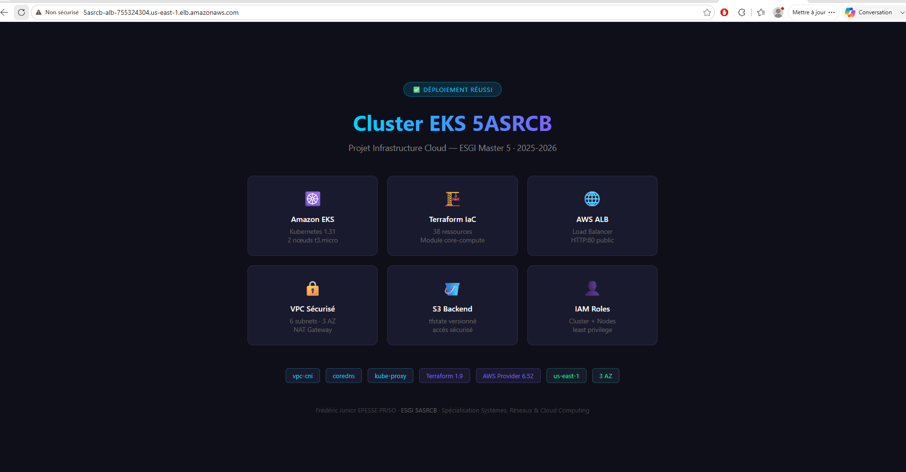
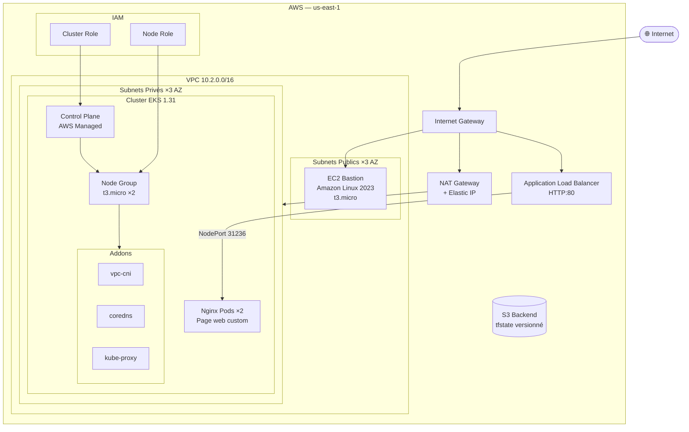
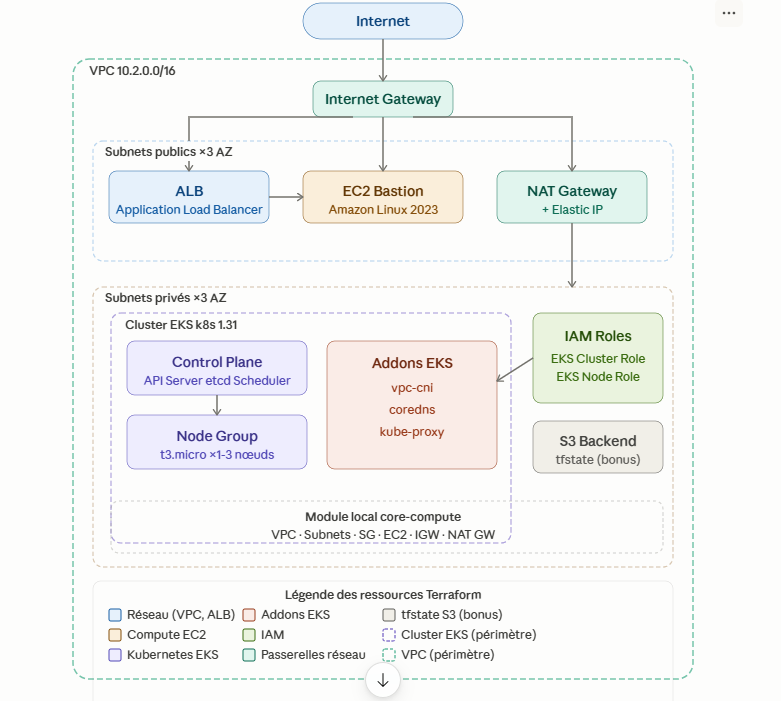
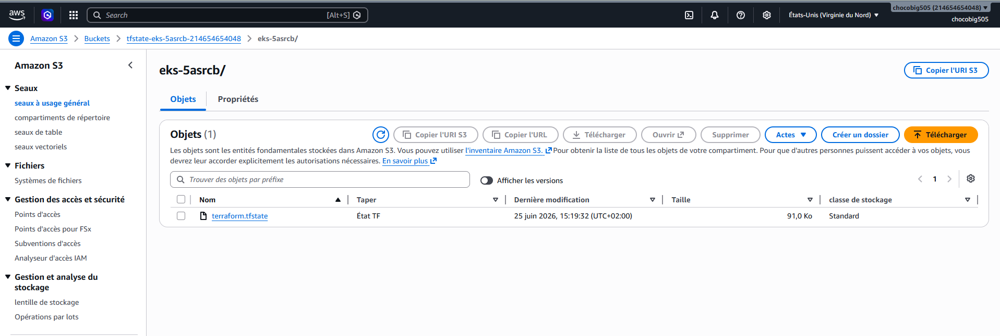
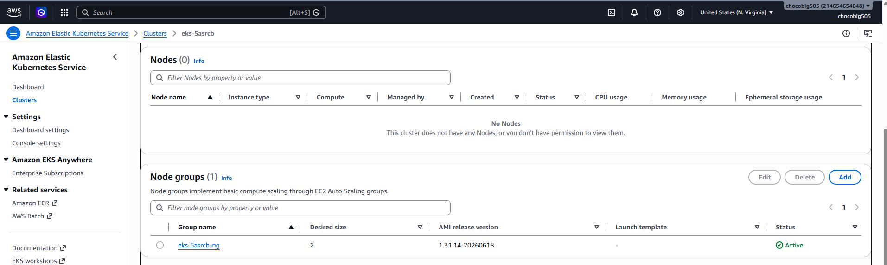
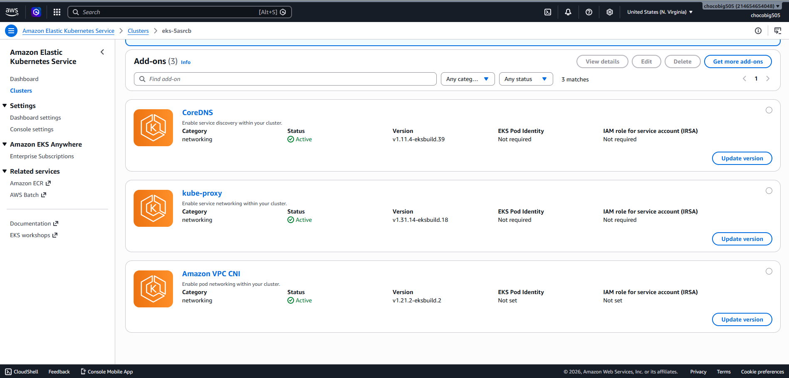
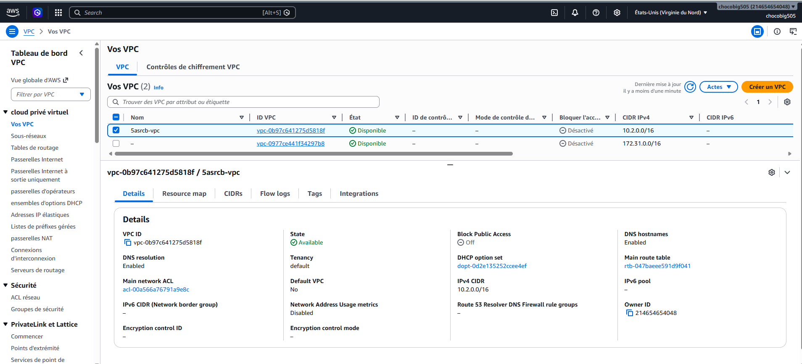
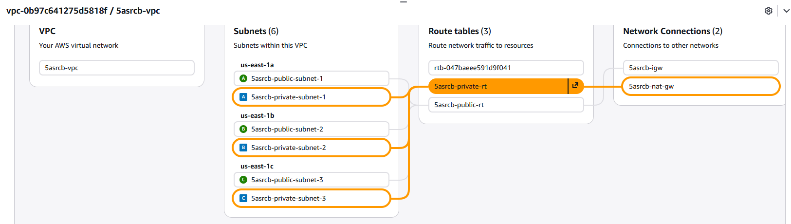
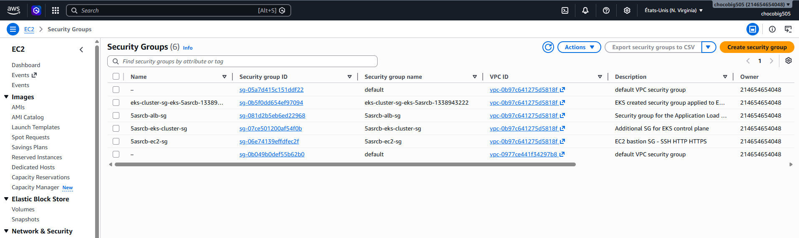

# 🚀 EKS Cluster via Terraform — Projet ESGI 5ASRCB

> Projet académique réalisé dans le cadre du cursus Master Ingénierie des Systèmes, Réseaux & Cloud Computing (ESGI 5ASRCB).
> Déploiement d'un cluster Amazon EKS complet sur AWS, 100 % codé à la main en Terraform.

---

## 🌐 Résultat final — Page web accessible via l'ALB



> URL : `http://5asrcb-alb-755324304.us-east-1.elb.amazonaws.com`

---

## 📐 Architecture





---

## 📁 Structure du projet

```
eks-terraform-5asrcb/
├── main.tf                          # Provider AWS + appel module core-compute
├── variables.tf                     # Variables globales
├── iam.tf                           # Rôles IAM EKS cluster + nodes
├── eks.tf                           # Cluster EKS, node group, addons
├── alb.tf                           # Application Load Balancer
├── outputs.tf                       # Outputs (IP, endpoint, DNS ALB...)
│
├── modules/
│   └── core-compute/                # Module local requis par le sujet
│       ├── vpc.tf                   # VPC + IGW + route table publique
│       ├── subnets_public.tf        # 3 subnets publics (tags EKS)
│       ├── subnets_private.tf       # 3 subnets privés + NAT GW
│       ├── sg.tf                    # Security groups EC2 + EKS
│       ├── ec2.tf                   # Instance EC2 bastion AL2023
│       ├── data.tf                  # AMI AL2023 + AZs (multi-région)
│       ├── user_data.sh             # Bootstrap Apache httpd
│       └── outputs.tf               # Exports vpc_id, subnet_ids...
│
└── preuves/                         # Preuves de déploiement
    ├── screenshots/                 # Captures console AWS + page web
    ├── terraform-outputs.txt        # Outputs terraform apply
    ├── kubectl-nodes.txt            # kubectl get nodes
    ├── kubectl-pods.txt             # kubectl get pods -n kube-system
    ├── eks-cluster.txt              # aws eks describe-cluster
    ├── alb.txt                      # aws elbv2 describe-load-balancers
    ├── s3-backend.txt               # aws s3 ls tfstate bucket
    └── nginx-via-alb.html           # Page HTML récupérée via curl
```

---

## ✅ Ressources déployées (38 au total)

| Ressource | Description |
|---|---|
| **VPC** | `10.2.0.0/16`, DNS support + hostnames activés |
| **3 subnets publics** | 1/AZ, `map_public_ip_on_launch`, tags EKS ALB |
| **3 subnets privés** | 1/AZ, tags EKS internal-LB, routés via NAT |
| **Internet Gateway** | Accès Internet subnets publics |
| **NAT Gateway + EIP** | Accès Internet sortant nœuds EKS |
| **EC2 bastion** | Amazon Linux 2023, t3.micro, Apache httpd |
| **Security Group EC2** | SSH + HTTP + HTTPS depuis 0.0.0.0/0 |
| **EKS Cluster** | Kubernetes 1.31, endpoint public + privé |
| **EKS Node Group** | t3.micro, scaling 1→3, subnets privés |
| **Addon vpc-cni** | Réseau pod-to-pod natif AWS |
| **Addon coredns** | DNS interne Kubernetes |
| **Addon kube-proxy** | Règles iptables services |
| **IAM Role cluster** | `AmazonEKSClusterPolicy` + `AmazonEKSVPCResourceController` |
| **IAM Role node** | `AmazonEKSWorkerNodePolicy` + CNI + ECR ReadOnly |
| **ALB** | Externe, HTTP:80, subnets publics |
| **Target Group + Listener** | Health check OK, forward → nœuds EKS |

---

## 🎁 Bonus réalisés

### Bonus 1 — Backend S3 sécurisé

Le `terraform.tfstate` est stocké sur S3 avec versioning activé et accès public bloqué.

```hcl
backend "s3" {
  bucket = "tfstate-eks-5asrcb-214654654048"
  key    = "eks-5asrcb/terraform.tfstate"
  region = "us-east-1"
}
```



### Bonus 2 — Nginx déployé sur EKS avec page web custom

Nginx déployé avec 2 replicas sur le cluster EKS, exposé via un NodePort (31236) attaché à l'ALB. Une page HTML custom avec design dark mode présente le projet.


---

## 📸 Preuves de déploiement

### Cluster EKS — Overview


### EKS — Node Group



### EKS — Addons (vpc-cni, coredns, kube-proxy)



### VPC + Subnets





### Application Load Balancer



---

## 🏆 Bonnes pratiques Terraform appliquées

### Variabilisation
Toutes les valeurs configurables sont dans `variables.tf` avec `description`, `type` et `default`. Aucune valeur hardcodée.

### Data sources
- `data.aws_ami` — AMI AL2023 dynamique, compatible multi-région
- `data.aws_availability_zones` — AZs de la région courante, compatible multi-région
- `data.aws_iam_policy_document` — policies IAM en HCL natif

### Module local `core-compute`
Encapsule tout le réseau et compute de base. Expose ses outputs (`vpc_id`, `subnet_ids`, `ec2_id`...) consommés par la racine.

### Compatibilité multi-région
- Aucune AZ hardcodée
- Aucune AMI hardcodée
- CIDRs calculés via `cidrsubnet()`
- Région passée par variable

### Tags Kubernetes sur les subnets
```hcl
# Subnets publics — requis pour l'ALB controller
"kubernetes.io/role/elb" = "1"

# Subnets privés — requis pour les LB internes
"kubernetes.io/role/internal-elb" = "1"

# Les deux
"kubernetes.io/cluster/<nom-cluster>" = "shared"
```

### Sécurité
- Nœuds EKS dans les **subnets privés**
- NAT Gateway pour les sorties
- Séparation des rôles IAM cluster / nœuds
- `sensitive = true` sur le CA EKS
- Backend S3 versionné + accès public bloqué
- `default_tags` provider centralisé

---

## 🚀 Déploiement

```bash
# 1. Init
terraform init

# 2. Plan
terraform plan

# 3. Apply (~15-20 min)
terraform apply -auto-approve

# 4. Configurer kubectl
aws eks update-kubeconfig --region us-east-1 --name eks-5asrcb
kubectl get nodes
kubectl get pods -n kube-system

# 5. Détruire après utilisation
terraform destroy -auto-approve
```

---

## ⚙️ Variables configurables

| Variable | Défaut | Description |
|---|---|---|
| `region` | `us-east-1` | Région AWS |
| `environment` | `dev` | Environnement |
| `project_name` | `5asrcb` | Préfixe ressources |
| `vpc_cidr` | `10.2.0.0/16` | CIDR du VPC |
| `eks_cluster_name` | `eks-5asrcb` | Nom du cluster |
| `eks_version` | `1.31` | Version Kubernetes |
| `node_instance_type` | `t3.micro` | Type nœuds EKS |
| `node_desired_size` | `2` | Nœuds souhaités |

---

## 🧠 Compétences acquises

**Terraform IaC** — module local, data sources, outputs inter-modules, `count` + `cidrsubnet()`, backend S3, `default_tags`

**Réseau AWS** — VPC multi-AZ, subnets publics/privés, IGW, NAT Gateway, route tables, Security Groups

**Amazon EKS** — control plane managé, node group, addons obligatoires, tags Kubernetes subnets, `kubectl`

**IAM** — rôles distincts cluster/nœuds, AWS managed policies, `assume_role_policy`

**Load Balancing** — ALB externe, target group, health check, listener HTTP

---

## 👨‍💻 Auteur

**Frédéric Junior EPESSE PRISO** — ESGI 5ASRCB  
Promotion 2025-2026 | Spécialisation Systèmes, Réseaux & Cloud Computing  
GitHub : [github.com/Whitedukecmr](https://github.com/Whitedukecmr)

---

## 📚 Références

- [Terraform AWS Provider](https://registry.terraform.io/providers/hashicorp/aws/latest/docs)
- [Amazon EKS User Guide](https://docs.aws.amazon.com/eks/latest/userguide/)
- [EKS Best Practices Guide](https://aws.github.io/aws-eks-best-practices/)
